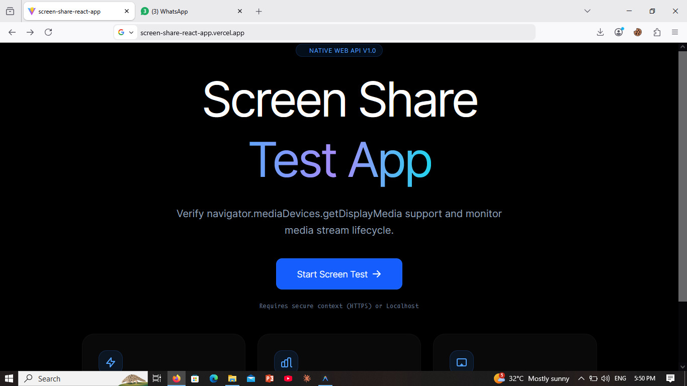
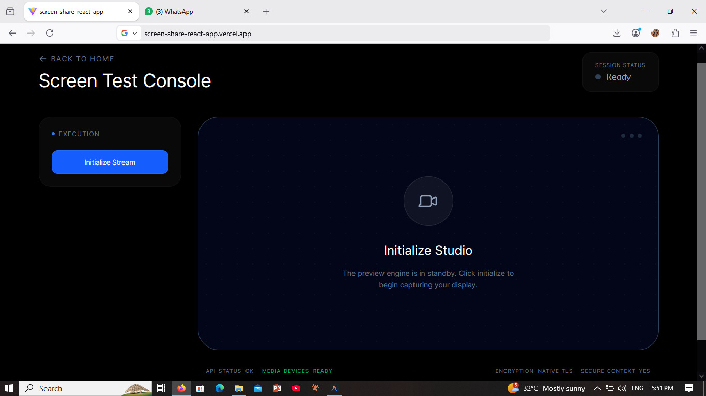
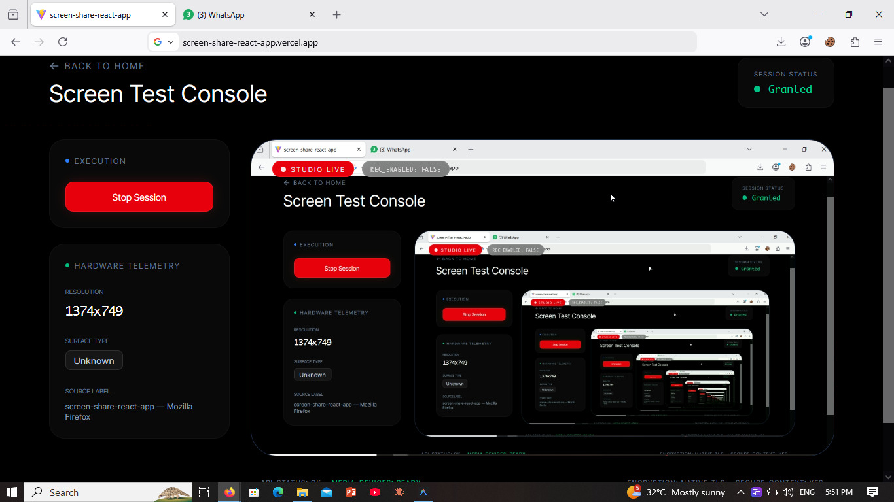
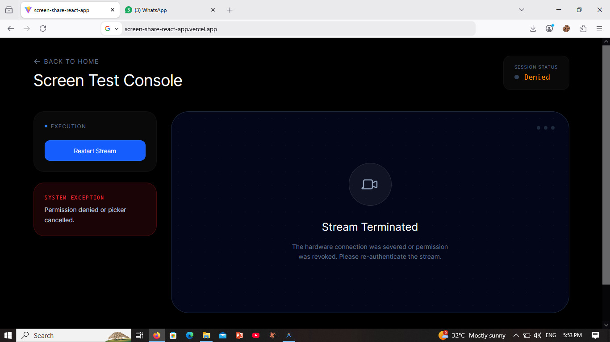

# Screen Share Test App

A production-quality React frontend application that tests browser screen sharing permissions and media stream lifecycle management. Built with **React 19**, **Vite**, **TypeScript**, and **Tailwind CSS v4**.

## 🚀 Setup Instructions

### Prerequisites
- Node.js (v18 or higher)
- A modern browser (Chrome or Edge recommended for full Screen Capture API support)

### Installation
1. Clone the repository
2. Install dependencies:
   ```bash
   npm install
   ```

### Running Locally
1. Start the development server:
   ```bash
   npm run dev
   ```
2. Open [http://localhost:5173](http://localhost:5173) in your browser.

## 🔄 Screen-Sharing Flow

The application follows a strict state-driven lifecycle managed by a custom hook (`useScreenShare`):

1.  **Capability Guard**: The Homepage checks `navigator.mediaDevices.getDisplayMedia` support before allowing entry to the test console.
2.  **Request State**: When "Start Sharing" is clicked, the UI enters a `requesting` state, disabling buttons and showing a loading indicator while the browser's native picker opens.
3.  **Permission Resolution**:
    - **Granted**: The stream is attached to a `<video>` element, and real-time metadata (resolution, surface type, label) is extracted via `track.getSettings()`.
    - **Denied/Cancelled**: The app catches `NotAllowedError` or `AbortError` and updates the UI with specific feedback.
4.  **Active Monitoring**: The hook attaches an `onended` listener to the video track. If the user clicks the browser's native "Stop Sharing" button, the app immediately transitions to the `ended` state.
5.  **Cleanup**: Upon stream termination or component unmount, all media tracks are explicitly stopped (`track.stop()`) and references are nulled to prevent memory leaks or "in-use" hardware indicators.

## 🛠 Tech Stack

- **Framework**: React 19 (Vite)
- **Language**: TypeScript
- **Styling**: Tailwind CSS v4
- **APIs**: Native Browser MediaDevices & Screen Capture API

## ⚠️ Known Limitations & Browser Quirks

- **Mobile Browsers**: Most mobile browsers (iOS Safari, Android Chrome) do not support `getDisplayMedia`. The app includes a compatibility check to notify users on unsupported devices.
- **Display Surface**: The `displaySurface` metadata (tab vs. window vs. monitor) is highly reliable in Chrome/Edge but may return `unknown` in some Firefox versions depending on privacy settings.
- **Audio**: Audio capture is explicitly disabled in this test app configuration (`audio: false`) to focus on video stream lifecycle.
- **Permissions**: Browsers may remember permission choices. If you want to re-test the "Denied" flow, you may need to reset site permissions in your browser's address bar.

## 📸 Screenshots

| Homepage | Test Console (Idle) |
| :---: | :---: |
|  |  |

| Active Sharing Session | Error / Permission Denied |
| :---: | :---: |
|  |  |

---
*Note: Please add your screenshot images to the `/screenshots` folder and rename them to match the filenames above to see them in this README.*
